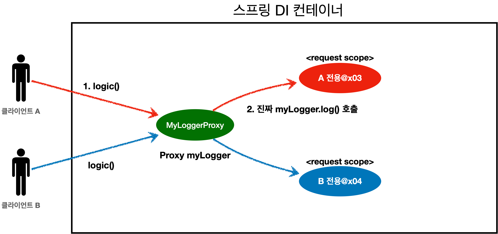

# 빈 스코프 (Bean Scope)

## 1. 빈 스코프란?

지금까지 우리는 스프링 빈이 스프링 컨테이너의 시작과 함께 생성되고,
컨테이너가 종료될 때까지 유지된다고 학습했다.

이것은 **스프링 빈의 기본 스코프가 싱글톤(Singleton)** 이기 때문이다.

**스코프(Scope)** 란  
👉 *빈이 존재하고 유지되는 범위*를 의미한다.

---

## 2. 스프링이 지원하는 스코프 종류

### 기본 스코프
- **singleton**
    - 기본값
    - 스프링 컨테이너 시작 ~ 종료까지 유지
    - 가장 넓은 범위

- **prototype**
    - 요청할 때마다 새로운 인스턴스 생성
    - 생성 + 의존관계 주입 + 초기화까지만 관여
    - 이후 관리하지 않음

### 웹 관련 스코프 (웹 환경에서만 사용 가능)
- **request** : HTTP 요청 하나당 하나의 빈
- **session** : HTTP 세션과 동일한 생명주기
- **application** : 서블릿 컨텍스트와 동일
- **websocket** : 웹소켓 생명주기와 동일

---

## 3. 스코프 지정 방법

### 컴포넌트 스캔 자동 등록

```java
@Scope("prototype")
@Component
public class HelloBean {}
```

### 수동 빈 등록

```java
@Scope("prototype")
@Bean
public HelloBean helloBean() {
    return new HelloBean();
}
```

---

## 4. 프로토타입 스코프란?

### 싱글톤 스코프
- 빈을 조회할 때마다 **같은 인스턴스 반환**

### 프로토타입 스코프
- 빈을 조회할 때마다 **항상 새로운 인스턴스 생성**
- 컨테이너 시작 시점에 빈 정의만 등록이 되고 인스턴스는 조회할 때 생성되어 반환하는 것

**핵심**
> 스프링 컨테이너는  
> 프로토타입 빈의 **생성, 의존관계 주입, 초기화까지만 관여**하고  
> 그 이후는 **전혀 관리하지 않는다**

---

## 5. 싱글톤 스코프 테스트

```java
public class SingletonTest {

    @Test
    void singletonBeanFind() {
        AnnotationConfigApplicationContext ac =
                new AnnotationConfigApplicationContext(SingletonBean.class);

        SingletonBean bean1 = ac.getBean(SingletonBean.class);
        SingletonBean bean2 = ac.getBean(SingletonBean.class);

        assertThat(bean1).isSameAs(bean2);
        ac.close();
    }

    @Scope("singleton")
    static class SingletonBean {

        @PostConstruct
        public void init() {
            System.out.println("SingletonBean.init");
        }

        @PreDestroy
        public void destroy() {
            System.out.println("SingletonBean.destroy");
        }
    }
}
```

---

## 6. 프로토타입 스코프 테스트

```java
public class PrototypeTest {

    @Test
    void prototypeBeanFind() {
        AnnotationConfigApplicationContext ac =
                new AnnotationConfigApplicationContext(PrototypeBean.class);

        PrototypeBean bean1 = ac.getBean(PrototypeBean.class);
        PrototypeBean bean2 = ac.getBean(PrototypeBean.class);

        assertThat(bean1).isNotSameAs(bean2);
        ac.close();
    }

    @Scope("prototype")
    static class PrototypeBean {

        @PostConstruct
        public void init() {
            System.out.println("PrototypeBean.init " + this);
        }

        @PreDestroy
        public void destroy() {
            System.out.println("PrototypeBean.destroy");
        }
    }
}
```

**중요**
- `@PreDestroy` 는 호출되지 않는다
- 프로토타입 빈의 종료 책임은 **클라이언트에게 있다**

---

## 7. 싱글톤 빈 + 프로토타입 빈 사용 시 문제점

### 문제 상황

- 싱글톤 빈에 프로토타입 빈을 주입하면
- **주입 시점에 생성된 프로토타입 빈이 계속 재사용됨**
- 요청마다 새로 생성되지 않는다

```java
@Scope("singleton")
static class ClientBean {

    private final PrototypeBean prototypeBean;

    @Autowired
    public ClientBean(PrototypeBean prototypeBean) {
        this.prototypeBean = prototypeBean;
    }

    public int logic() {
        prototypeBean.addCount();
        return prototypeBean.getCount();
    }
}
```

👉 **의도한 프로토타입 동작이 깨진다**

---

## 8. 해결 방법 ① ApplicationContext 직접 조회 (권장 ❌)

```java
@Autowired
private ApplicationContext ac;

public int logic() {
    PrototypeBean prototypeBean = ac.getBean(PrototypeBean.class);
    prototypeBean.addCount();
    return prototypeBean.getCount();
}
```

❌ 문제점
- 스프링 컨테이너에 강하게 의존
- 테스트 어려움
- DL(Dependency Lookup) 남용

---

## 9. 해결 방법 ② ObjectProvider (권장 ✅)

```java
@Autowired
private ObjectProvider<PrototypeBean> prototypeBeanProvider;

public int logic() {
    PrototypeBean prototypeBean = prototypeBeanProvider.getObject();
    prototypeBean.addCount();
    return prototypeBean.getCount();
}
```

### ObjectProvider 특징
- 필요한 시점에 빈 조회 (지연)
- 테스트 용이
- 스프링 의존 (하지만 최소)

---

## 10. 해결 방법 ③ JSR-330 Provider (자바 표준)

```java
@Autowired
private Provider<PrototypeBean> provider;

public int logic() {
    PrototypeBean prototypeBean = provider.get();
    prototypeBean.addCount();
    return prototypeBean.getCount();
}
```

### Provider 특징
- 자바 표준
- 스프링 외 환경에서도 사용 가능
- 기능 단순

---

## 11. 웹 스코프란?

웹 환경에서만 동작하는 특별한 스코프

### 특징
- HTTP 요청 단위로 관리
- 종료 시점까지 스프링이 관리
- `@PreDestroy` 호출됨

---

## 12. request 스코프 예제

```java
@Component
@Scope(value = "request")
public class MyLogger {

    private String uuid;
    private String requestURL;

    public void setRequestURL(String requestURL) {
        this.requestURL = requestURL;
    }

    public void log(String message) {
        System.out.println("[" + uuid + "][" + requestURL + "] " + message);
    }

    @PostConstruct
    public void init() {
        uuid = UUID.randomUUID().toString();
        System.out.println("request scope bean create: " + this);
    }

    @PreDestroy
    public void close() {
        System.out.println("request scope bean close: " + this);
    }
}
```

---

## 13. request 스코프 빈 주입 문제

- 스프링 컨테이너가 뜨는 시점 즉,  싱글톤 빈 생성 시점에는 아직 고객의 요청이 없기 때문에 request 스코프가 존재하지 않음
- 실행 시 오류 발생

```java
@Controller
@RequiredArgsConstructor
public class LogDemoController {
    private final LogDemoService logDemoService;
    private final MyLogger myLogger;

    @RequestMapping("log-demo")
    @ResponseBody
    public String logDemo(HttpServletRequest request) {
        String requestURL = request.getRequestURL().toString();
        myLogger.setRequestURL(requestURL);
        myLogger.log("controller test");
        logDemoService.logic("testId");
        return "OK";
    }
}
```

```java
@Service
@RequiredArgsConstructor
public class LogDemoService {
    private final MyLogger myLogger;

    public void logic(String id) {
        myLogger.log("service id = " + id);
    }
}
```

```
Scope 'request' is not active for the current thread
```

---

## 14. 해결 방법 ① ObjectProvider

```java

// http요청이 들어온 메서드에서 호출하기 때문에 에러가 해결된다.
@Controller
@RequiredArgsConstructor
public class LogDemoController {
  private final LogDemoService logDemoService;
  private final ObjectProvider<MyLogger> myLoggerObjectProvider;

  @RequestMapping("log-demo")
  @ResponseBody
  public String logDemo(HttpServletRequest request) {
    MyLogger myLogger = myLoggerObjectProvider.getObject();
    String requestURL = request.getRequestURL().toString();
    myLogger.setRequestURL(requestURL);
    myLogger.log("controller test");
    logDemoService.logic("testId");
    return "OK";
  }
}
```

```java
@Service
@RequiredArgsConstructor
public class LogDemoService {
    private final ObjectProvider<MyLogger> myLoggerObjectProvider;

    public void logic(String id) {
        MyLogger myLogger = myLoggerObjectProvider.getObject();
        myLogger.log("service id = " + id);
    }
}
```

## 🚀스프링 웹 스코프와 ObjectProvider 동작 원리

### 1. 컨테이너가 뜰 때 (서버 기동 시점)
* 스프링은 `@Component`가 붙은 `MyLogger` 클래스를 스캔한다.
* "오, `MyLogger` 빈 설계도(설명서) 발견! 근데 이건 `request` 스코프네?"라고 인지한다.
* 컨트롤러를 만들려고 보니 `MyLogger`가 필요하다. 하지만 지금은 HTTP 요청이 없어서 인스턴스를 만들 수가 없다.
* 이때 `ObjectProvider`가 구원투수로 등장한다. 스프링은 **"나중에 MyLogger 설명서 보고 인스턴스 만들어줄 수 있는 도구(Provider)"**를 컨트롤러에 대신 꽂아준다. 서버는 에러 없이 무사히 켜진다.

---

### 2. 실제 HTTP 요청이 올 때 (런타임 시점)
* 사용자가 접속하여 `logDemo()` 메서드가 실행된다.
* `myLoggerObjectProvider.getObject()`가 호출된다.
* 이때 Provider가 비로소 `MyLogger` 설명서를 집어 들고, "지금 HTTP 요청이 들어왔으니 이제야말로 인스턴스를 하나 찍어내야겠다!" 하며 객체를 생성한다.
* 생성된 인스턴스의 주소값을 내 코드에 전달해 준다.


---

### 💡 여기서 핵심 포인트 (복습)
**"설명서를 보고 나중에 인스턴스를 생성해준다"**는 부분이 핵심이다.

* **싱글톤**은 서버가 뜰 때 설명서를 보고 **미리** 인스턴스를 만들어둔다.
* **리퀘스트 스코프**는 서버가 뜰 때 설명서만 들고 있다가, **실제 요청이 오면** 그제서야 인스턴스를 만든다.

## 🕵️‍♂️ 컨트롤러와 서비스가 같은 빈을 공유하는 원리

### 1. HTTP 요청 = 전용 쓰레드 할당했다.
* 톰캣 같은 서버는 HTTP 요청이 들어오면 **쓰레드를 하나 딱 배정**해준다.
* 요청이 끝날 때까지 모든 로직(Controller -> Service -> Repository)은 **그 쓰레드 안에서만** 돌아가게 했다.

### 2. 쓰레드 안에 숨겨진 "비밀 금고"를 활용했다.
* 스프링은 이 쓰레드 안에 **"이번 요청에서만 쓸 빈들을 모아두는 비밀 금고"**를 마련해둔다.
* 컨트롤러에서 처음 `getObject()`를 하면:
  1. 스프링이 `MyLogger` 인스턴스를 새로 만든다.
  2. 이 인스턴스를 해당 쓰레드의 **비밀 금고**에 딱 넣어둔다.
* 서비스에서 두 번째로 `getObject()`를 하면:
  1. 스프링이 먼저 **비밀 금고**를 뒤져본다.
  2. "어? 아까 컨트롤러가 만들어둔 `MyLogger`가 이미 있네?" 하고 **새로 안 만들고 보관 중인 그 녀석을 꺼내준다.**


### 3. 쓰레드가 다르면 절대 안 섞이게 했다.
* 다른 사용자의 요청은 **다른 쓰레드**에서 돌아가니까, **다른 비밀 금고**를 사용한다.
* 그래서 사용자 A와 사용자 B의 `MyLogger`는 서로의 존재도 모른 채 절대 섞이지 않게 했다!

---

### 💡 최종 요약했다.
* **핵심 기술**: **쓰레드(Thread)** 단위로 객체를 보관하는 기술을 썼다.
* **공유 원리**: 같은 쓰레드(하나의 HTTP 요청) 안에서는 `getObject()`를 백 번 호출해도, 스프링이 금고에서 **이미 만들어둔 같은 객체**를 꺼내주기 때문에 같은 인스턴스를 공유할 수 있는 거다!
---

## 15. 해결 방법 ② 스코프 프록시 (권장 ⭐⭐⭐)

```java
@Component
@Scope(value = "request", proxyMode = ScopedProxyMode.TARGET_CLASS)
public class MyLogger {}
```

```java
// 다시 MyLogger 의존성 주입을 받는다.
@Controller
@RequiredArgsConstructor
public class LogDemoController {
    private final LogDemoService logDemoService;
    private final MyLogger myLogger;

    @RequestMapping("log-demo")
    @ResponseBody
    public String logDemo(HttpServletRequest request) {
 
        String requestURL = request.getRequestURL().toString();
        myLogger.setRequestURL(requestURL);
        myLogger.log("controller test");
        logDemoService.logic("testId");
        return "OK";
    }
}
```

```java
@Service
@RequiredArgsConstructor
public class LogDemoService {
    private final MyLogger myLogger;

    public void logic(String id) {
        myLogger.log("service id = " + id);
    }
}
```


### 동작 원리



- CGLIB으로 가짜 프록시 객체 생성해서 주입해 준다.
- 실제 요청 시 진짜 request 빈을 조회
- 클라이언트는 싱글톤처럼 사용 가능

## 🧙‍♂️ 가짜 프록시(Proxy) 객체의 동작과 특징

### 1. 동작 원리
* CGLIB라는 라이브러리로 내 클래스를 상속받은 가짜 프록시 객체를 만들어 주입한다.
* 가짜 프록시 객체는 요청이 오면 그때 내부에서 진짜 빈을 요청하는 위임 로직을 가진다.
* 가짜 프록시 객체는 내부에 진짜 `myLogger`를 찾는 방법을 알고 있다.
* 클라이언트가 `myLogger.log()`를 호출하면 사실은 가짜 프록시 객체의 메서드를 호출한 것이다.
* 가짜 프록시 객체는 request 스코프의 진짜 `myLogger.log()`를 호출한다.
* 가짜 프록시 객체는 원본 클래스를 상속받아 만들어졌으므로 클라이언트는 원본 여부를 모른 채 다형성을 활용해 동일하게 사용한다.


### 2. 특징 정리
* 가짜 프록시 객체는 실제 request scope와 직접적인 관계가 없다. 단순한 위임 로직만 있는 가짜이며 싱글톤처럼 동작한다.
* 프록시 객체 덕분에 클라이언트는 마치 싱글톤 빈을 사용하듯이 편리하게 request scope를 사용한다.
* Provider를 사용하든 프록시를 사용하든 핵심 아이디어는 진짜 객체 조회를 꼭 필요한 시점까지 지연 처리한다는 점이다.


---

### 💡 요약
* 가짜를 미리 세워두고 진짜 객체 조회를 필요한 시점까지 지연했다.
* 이를 통해 웹 스코프 빈의 생성 시점 문제를 해결하고 싱글톤처럼 편하게 사용한다.


---

### 💡 한 줄 요약했다.
**"가짜를 싱글톤처럼 미리 세워두고, 실제 호출이 일어날 때만 진짜 빈을 찾아오게 해서 주입 시점의 문제를 완벽히 해결했다!"**
---

## 16. 스코프 프록시 핵심 정리

- 실제 객체 생성은 **요청 시점**
- 프록시는 싱글톤처럼 주입됨
- 내부에서 진짜 객체로 위임
- DI + 다형성 + 지연 로딩의 결정판

## 🧙‍♂️ 스코프 프록시(Proxy)마법

### 1. 설정은 딱 한 줄만 추가
* `MyLogger` 클래스의 `@Scope` 설정에 `proxyMode` 옵션을 넣는다.
```java
@Component
@Scope(value = "request", proxyMode = ScopedProxyMode.TARGET_CLASS)
public class MyLogger { ... }
```
* 이렇게 하면 `ObjectProvider`를 싹 다 지우고, 처음에 하고 싶었던 것처럼 **`private final MyLogger myLogger;`**로 바로 주입받을 수 있게 했다.

### 2. 가짜 객체(Proxy)를 미리 꽂아줬다.
* 서버가 뜰 때 진짜 `MyLogger`는 만들 수 없으니(요청이 없어서), 스프링이 진짜를 쏙 빼닮은 **가짜(CGLIB이라는 라이브러리로 만든 프록시 객체)**를 미리 만들어서 컨트롤러와 서비스에 꽂아버렸다.
* 이 가짜 객체는 내부에 **"진짜 빈을 찾는 로직"**만 딱 들어있는 껍데기다.


### 3. 호출하는 순간 "바꿔치기" 했다.
* 실제로 `myLogger.log()`를 호출하는 그 순간, 가짜 객체 내부에 있는 로직이 작동한다.
* 가짜가 **"아, 지금 HTTP 요청 들어왔지? 아까 그 비밀 금고(ThreadLocal)에서 진짜 MyLogger 꺼내와!"**라고 동작해서 진짜의 메서드를 대신 호출해준다.
* 개발자 입장에서는 이게 가짜인지 진짜인지 신경 안 쓰고 그냥 싱글톤 빈 쓰듯이 편하게 쓰면 되게 했다.

---

### 💡 최종 요약했다.
* **핵심 기술**: **CGLIB**이라는 라이브러리로 내 클래스를 상속받은 가짜 프록시 객체를 만든다.
* **사용 이유**: 비즈니스 로직은 **싱글톤 빈을 쓰는 것처럼 아주 깔끔하게 유지**하면서, 내부적으로는 **리퀘스트 스코프의 이점(Thread 별 격리)**을 다 누릴 수 있게 하기 위해서다!
* **결론**: 프록시 방식이나 Provider 방식이나 핵심은 **"진짜 객체 조회를 필요한 시점까지 지연처리 한다"**는 점으로 똑같다!

---

## 17. 주의사항 및 실무 정리

- 프로토타입 스코프는 실무에서 거의 사용되지 않음
- 웹 스코프도 꼭 필요한 경우만 사용
- 무분별한 스코프 사용은 유지보수 난이도 폭증

---

## 18. 최종 정리

- 기본은 **싱글톤**
- 프로토타입은 특수한 경우만
- 싱글톤 + 프로토타입 → Provider 사용
- 웹 스코프 → 프록시 방식 권장
- **스코프는 강력하지만 신중히 사용해야 한다**
